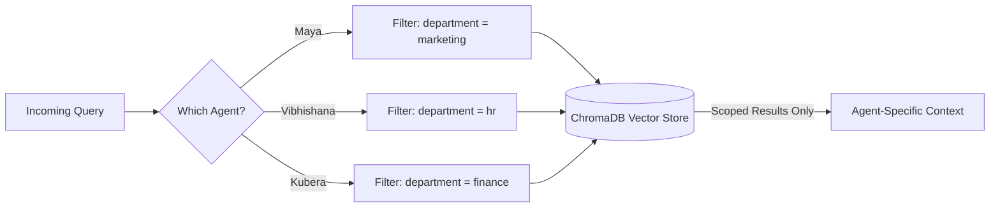

<div align="center">

# 🏛️ Axiom OS
### Multi-Agent RAG Boardroom Simulation


**A production-grade multi-agent RAG dashboard that simulates a corporate C-suite — where distinct AI executives enforce isolated policies, retrieve department-scoped knowledge, and reason across a shared boardroom memory.**

</div>

---

## Table of Contents

- [Overview](#overview)
- [The Executive Agents](#the-executive-agents)
- [Data Isolation Model](#data-isolation-model)
- [Key Features](#key-features)
- [Tech Stack](#tech-stack)
- [Getting Started](#getting-started)
- [Repository Structure](#repository-structure)
- [Limitations](#limitations)
- [Author](#author)

---

## Overview

Most RAG chatbots are a single "know-it-all" persona pulling from one shared knowledge base. **Axiom** rejects that model entirely.

Instead, it simulates a real corporate structure: three distinct AI executives — each with department-scoped RAG access, strict policy enforcement, and shared conversational awareness of what the other executives are approving or rejecting. The result is a system that reasons the way a real leadership team does — through negotiation, pushback, and cross-functional awareness, not a single omniscient answer engine.

Built for:
- Developers exploring multi-agent orchestration patterns
- Teams evaluating department-scoped RAG isolation
- Researchers studying shared-memory agent coordination
- Anyone building policy-constrained AI advisory systems

---

## Tech Stack

<p>
  
  
  
  
</p>


## The Executive Agents

| Agent | Role | Domain Access | Behavior |
|---|---|---|---|
| **Maya** | Marketing Lead | Marketing budgets, campaign data | Reports on spend and campaign performance |
| **Vibhishana** | People Lead | Hiring policies, notice periods | Strictly enforces HR policy, rejects violations |
| **Kubera** | Finance Lead | Runway, budget approvals | Aggressively vetoes unapproved spend |

Each agent is not just a prompt persona — it is a retrieval-scoped identity. Vibhishana cannot see Marketing's budget data, and Maya cannot see HR's headcount policies. The isolation is enforced at the vector search layer, not just through instructions.

---

## Data Isolation Model



```python
search_kwargs={'filter': {'department': department}}
```

This single filter is the backbone of Axiom's security model. Regardless of prompt manipulation attempts, the HR agent's vector search physically cannot retrieve Marketing documents — the restriction happens at the database query level, not the LLM's discretion.

---

## Key Features

| Feature | Description |
|---|---|
| **Parallel Multi-Agent Routing** | `@status` / `@all` commands fire concurrent RAG queries via `asyncio.gather`, unified into one response |
| **Strict Data Isolation** | Vector searches filtered by `department` metadata — cross-department leakage is structurally impossible |
| **Session-Based Memory** | Conversation history isolated by `session_id` — 50+ concurrent users without memory contamination |
| **Zero Action Hallucination** | Agents behave strictly as advisors; extensive prompt engineering prevents claims of taking physical system actions |
| **Cross-Functional Reasoning** | Agents share conversation history, enabling one executive to reference another's decisions in real time |

---


| Layer | Technology |
|---|---|
| **LLM Engine** | Groq (`llama-3.1-8b-instant`) — sub-second inference |
| **Orchestration** | LangChain (Python) + `asyncio` for parallel agent execution |
| **Vector Database** | ChromaDB (local SQLite/Parquet), metadata-filtered per department |
| **Backend** | FastAPI (fully async endpoints) |
| **Frontend** | React + Vite — custom minimalist CSS, zero UI framework dependency |

---

## Getting Started

### 1. Clone the repository

```bash
git clone https://github.com/shriram1206/axiom-multi-agent-rag.git
cd axiom-multi-agent-rag
```

### 2. Start the FastAPI backend

```bash
cd backend
python -m venv venv
source venv/bin/activate   # Windows: venv\Scripts\activate
pip install -r requirements.txt

# Create your environment variables
cp .env.example .env
# Edit .env and add your GROQ_API_KEY

# Build the local ChromaDB knowledge base
python ingest.py

# Start the server
uvicorn main:app --reload
```

### 3. Start the React frontend

```bash
# In a new terminal
cd frontend
npm install
npm run dev
```

---

## Repository Structure

```bash
axiom-multi-agent-rag/
├── backend/
│   ├── main.py                # FastAPI entrypoint
│   ├── ingest.py              # ChromaDB ingestion script
│   ├── agents/                # Agent definitions (Maya, Vibhishana, Kubera)
│   ├── routes/                 # API route handlers
│   ├── memory/                  # Session-based conversation memory
│   └── requirements.txt
├── frontend/
│   ├── src/
│   ├── index.html
│   └── package.json
└── README.md
```

---

## Limitations

- Vector store is local (SQLite/Parquet) — not yet distributed for multi-node scaling
- Department filters rely on correctly tagged ingestion metadata; mis-tagged documents could bypass isolation
- No persistent long-term memory across sessions — history resets per `session_id`
- Agent personas are prompt-engineered, not fine-tuned — behavior consistency depends on prompt robustness

---


## Author

**Shri Ram M**

[](https://linkedin.com/in/shriram-m-sde)
[](https://github.com/shriram1206)
[](mailto:shriram.coder@gmail.com)

---

<div align="center">
<i>Executives that push back. Data that stays isolated. Answers in under two seconds.</i>
</div>
